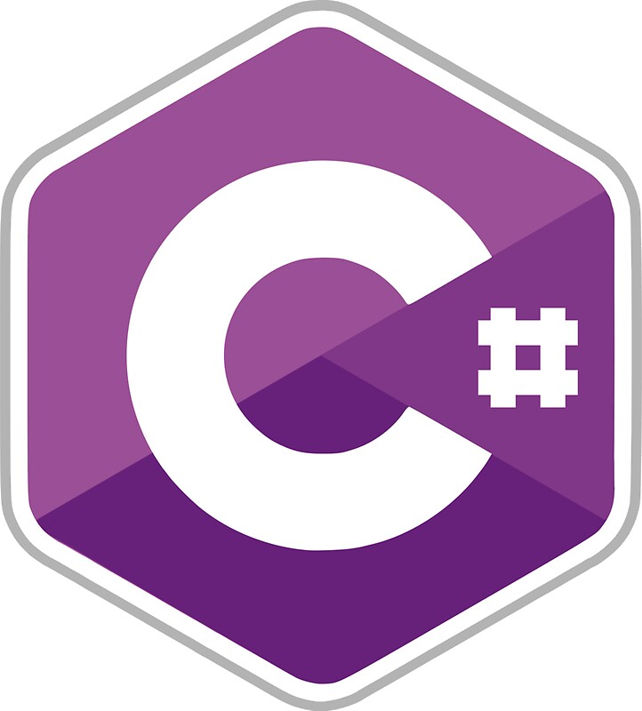
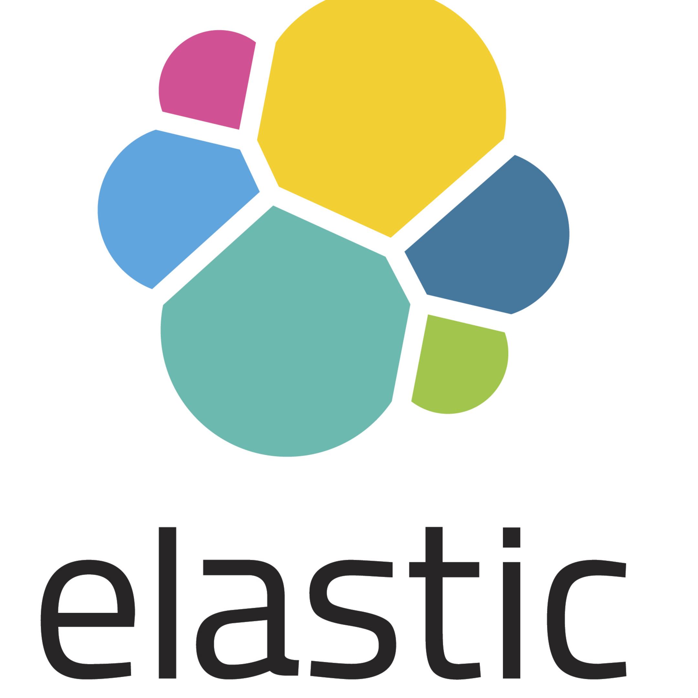

# Hey 🖐️, I'm vlad-jpeg 🐱‍💻!

...................Look at my vscode theme🗿🗿🗿......................
</img>

## 🧑‍💻About Me

#### Hi, **I'm Vladislav Sidorkin .NET backend Developer** living in  **Ufa, Russia**.

#### I've been developing **backend services** and containerized microservices for over 3 years. I am doing containerization and orchestration of **microservices**. Also i implement **CI\CD pipelines**.

#### Had experience in **mentoring**, coding, managing a small backend team as a **team lead**. I also rewrote monolithic applications from .NET Framework to .NET 5-6 versions to microservice architecture.

#### I develop tests and various health monitoring tools: **end-to-end, unit, integration, healh checking**. Maintain documentation, diagrams (Star UML, MS Visio).

#### I keep my finger on the pulse of new technologies. I take the best practices from various projects and am not afraid to try new things. I like to discuss new versions of the technologies used and to study together.

## 🌄 Languages and Tools

<code>
  
  
  
  
  
  
  
  
  
  
  
</code>

<!-- ## My VS Code theme 🗿🗿🗿
<!--  -->
<!-- <code></code> -->

## 📚 The programming books I've read
<code>
  
  
  
  

</code>

## 📖 Books in progress

## 📉Stats

 <code>

</code>
<!-- # <code>

</code> -->

#### *PS. Most of the projects were implemented under the NDA in closed repositories. Here are just my practices using the new version of dotnet.*

